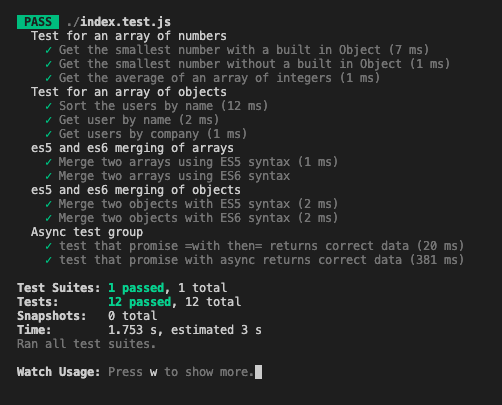

# JavaScript

In the JavaScript folder, open a terminal and install the app with:

```bash
npm install
```

You only need to install once.

To start your daily exercises, start Jest with the following command:

```bash
npm test
```

Then open **index.js** with your favorite editor and complete the JavaScript exercises. When you have completed the exercises correctly, **Jest** will list the following:


