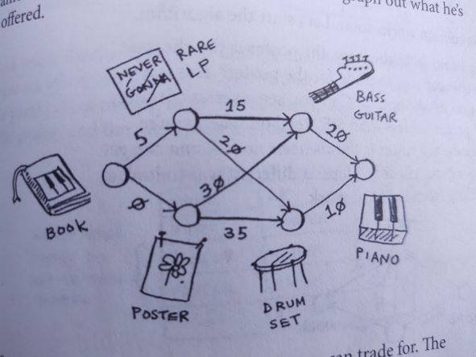
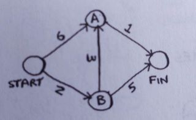
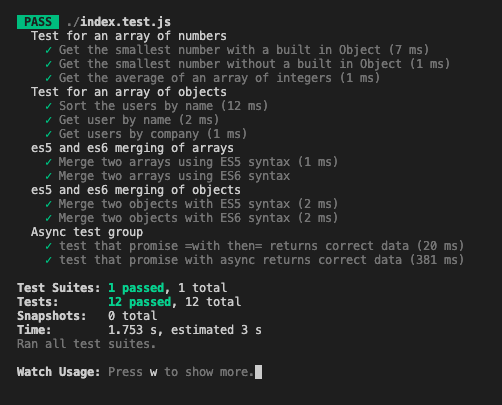

# Dijkstra's Algorithm

Shortest weighted path.

## Abstract Data Structure - graphs

Create **_hash tables_** to represent the following **_graphs_**. in the images below.

Then create a function that accepts the graph hash table as a parameter and returns the shortest path and smallest value in a hash table using Dijkstra's Algorithm. Hint: Dijkstra's algorithm needs hash tables for their corresponding **_cost_** and **_parent_** as well as an array to keep track of which nodes are **processed**.

Test the function with all the graphs.






---

In the JavaScript folder, open a terminal and install the app with:

```bash
npm install
```

You only need to install once.

To start your daily exercises, start Jest with the following command:

```bash
npm test
```

Then open **index.js** with your favorite editor and complete the JavaScript exercises. When you have completed the exercises correctly, **Jest** will list the following:


